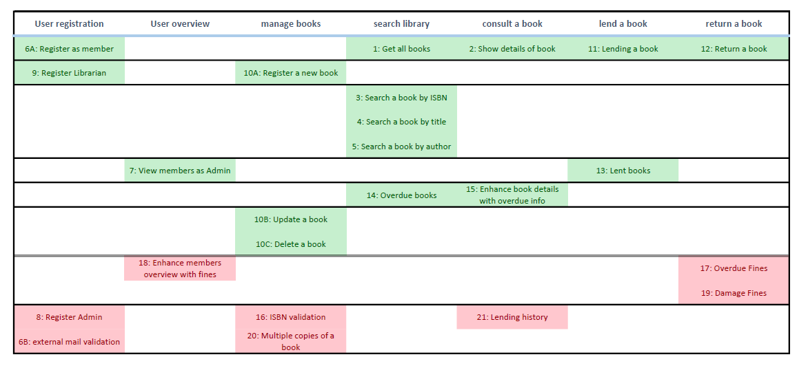

# Digibooky

Digibooky is going to revolutionize the classic libraries. Users will come to the VR offices where VR headsets are available. 
Using these VR headsets, users can roam Digibooky's digital library, where they can make their preferred selection of books to borrow.

The front-end of Digibooky will run on the VR enabled computer. 
It'll be developed in a later stage by a company specialized in VR applications.

The front-end of Digibooky will communicate with the back-end of Digibooky through a REST(ful) Web API over HTTP(S), 
using JSON as its message format. This back-end will contain the entire domain and all the business logic.
It's your job to implement this back-end.

## Technical requirements for JAVA

- Create a new GitHub repository (one per team)
- Provide a REST(ful) Web API (with JSON as the message / body format)
- Use Spring Boot (latest release)
- Use Maven
- Set up a Jenkins or Travis for continuous integration
    - We'll help you with this...
- Perform logging (use spring-boot-starter's logging dependencies: logback and slf4j)
    - Certainly log all interactions with the application that can be defined as "errors"
        - E.g., unauthorized access, illegal arguments, exceptions in general,...
- Include OpenAPI using Swagger(UI) to provide a readable documentation/manual of your REST(ful) Web API
- Use Lists or HashMaps to store your data (fake in-memory database).
    - Store them in a specific class / classes (e.g. `AuthorTable` or `DigibookyDatabase`)
    - (You could also try to store it in files, but that's not recommended)
- (This only applies when ORM/JPA has been taught): use JPA (Hibernate / EclipseLink) in combination with PostgreSQL or Oracle to store and access the data in a persistent way
    - Correctly set up and handle the transactions.

## Technical requirements for .NET

- Create a new GitHub repository (one per team)
- Provide a REST(ful) Web API (with JSON as the message / body format)
- Use ASP.NET Core Web API
- Use AzureDevops for continuous integration
    - We'll help you with this
- Perform logging (use logging provided by .NET Core)
    - Certainly log all interactions with the application that can be defined as "errors"
        - E.g., unauthorized access, illegal arguments, exceptions in general,...
- Include OpenAPI using Swagger(UI) to provide a readable documentation/manual of your REST(ful) Web API
- Use Lists or HashMaps to store your data (fake in-memory database).
    - Store them in a specific class / classes (e.g. `AuthorTable` or `DigibookyDatabase`)
    - (You can also try to store it in files, but that's not recommended)
- (This only applies when ORM has been taught): Use Entity Framework instead of in-memory Lists,...  

## Architectural Setup

Provide a multi-module setup where each module (not package) represents a 'layer'.
- Although a layered architecture might not be the best architecture (for big projects), when used properly(!), it is actually 
a nice way of separating concerns in your code. Read the following links:
    - http://www.codingthearchitecture.com/2016/04/25/layers_hexagons_features_and_components.html
    - http://www.codingthearchitecture.com/2015/03/08/package_by_component_and_architecturally_aligned_testing.html
- We're proposing 5 layers: war (top-level), api, service, domain and infrastructure (lowest-level)
    - But, at the very least provide an api, service and domain module.
    - The war module can be used to package together the whole application (also contains the Main Class)
    - The infrastructure can be used to contain code on which all other modules can depend.
    
Furthermore, use DTOs for encapsulating the payload of a request or response consumed or produced by your Web API. 
(and ideally a different DTO for both the request and response of a call to your Web API)
- https://martinfowler.com/eaaCatalog/dataTransferObject.html  

## Project requirements

- Define team rules
    - Daily stand-up at X
    - Scrum master role (fixed, rotating)
    - Ownership of stories
    - Pairing/repairing
    - Code review sessions
- Review/discuss the project (board session)
    - General understanding of the functionality (stories)
    - General understanding of the technical setup
    - Domain modeling 
- Create a Kanban board (Trello) to visualize work
    - Define the process steps
    - Define the transitions (DoD)
    - Add tasks to the board (color coded, prioritized)
        - Functional tasks (stories)
            - Technical grooming
            - Define subtasks
		- Non-functional tasks
		    - Technical setup
            - GitHub repository (add Switchfully trainers!)
            - Setup communication channels
		- Questions?
 - Set up a shared drive to share useful documentation
    - Domain model, detail of stories, team rules, ...

## Functional Stories

The functional requirements are written down as stories. 

- The functional analyst will be available to answer all your questions (they'll speak for the customer Digibooky)
- The functional analyst made some design decisions, if you want to challenge those, you always can. Come prepared though. :grin:
    
### Story 1: Get all books
As a user I want to get all books registered in the system, so I can see which books are offered by Digibooky.
- These books should contain an ISBN, title and the author's last and first name
- Prioritization: Must-Have

### Story 2: Show details of book
As a user I want to get the details of a single book, so I can inspect a single book more closely.
- ISBN, title, author & a small summary make up all the details of a single book.
- Prioritization: Must-Have

### Story 3: Search a book by ISBN
As a user I want to search for a book by entering a part of the ISBN, so I can efficiently find a specific book. 
- I should be able to enter wildcards if I don't know the complete ISBN.
    - Hint: use regex for the wildcards
- Prioritization: Must-Have

### Story 4: Search a book by title
As a user I want to search for a book by entering a part of the title, so I can efficiently find a specific book. 
- I should be able to enter wildcards if I don't know the complete title.
- Prioritization: Must-Have

### Story 5: Search a book by author
As a user I want to search for a book by entering a part of the author, so I can efficiently find a specific book. 
I should be able to enter wildcards if I don't know the complete name of the author. It should be possible to use 
only the first name, only the last name or both.
- Prioritization: Must-Have

### Story 6A: Register as user
As a user I want to be able to register myself as a new Digibooky user, so I can perform additional actions. 
This user should have a unique INSS (social security number), last name, first name, email, street name, street number, postal code and city. 
- A user should contain a unique user identification number (create/choose your own, don't use INSS)
- The INSS should be filled in and unique.
- The email should be filled in and unique. 
    - Also validate that the email is of the form `x@x.x`, where x can be any type and amount of letters and numbers.
- The last name and city should be filled in.
- Out of scope: validation of the postal code and the city.
- Prioritization: Must-Have

### Story 6B: external mail validation upon registration
Instead of doing the email validation yourself, rely on the external mail validation service described below.
- Prioritization: Nice-To-Have

*SOAP*
- https://cdyne.com/downloads/SPECS_Email-Verification.pdf
- http://ws.cdyne.com/emailverify/Emailvernotestemail.asmx?wsdl

*REST*
- https://trumail.io/documentation

### Story 7: View members as Admin
As an Admin user I want to view all members within the system, so I can keep track of all the members.
- An Admin user contains a unique user identification number, last name, first name and email.
- One Admin user should exist on startup.
- If any other user tries to view all user within the system, the server should respond with 403 Forbidden and a custom message.
    - Hint: provide the unique user identification number as a means of authentication and use it to validate authorization.
- The INSS should be excluded from the members when returned (sensitive information)
- Prioritization: Must-Have

### Story 8: Register Admin
As an Admin user I want to register a new Admin user, so I can have multiple users with Administrator access.
- If any other user tries to register an Admin user, the server should respond with 403 Forbidden and a custom message.
- Prioritization: Nice-To-Have

### Story 9: Register Librarian
As an Admin user I want to register a new Librarian user, so I can have users with Moderator access.
- A Librarian user contains the same information as an Admin user.
- If any other user tries to register a Librarian user, the server should respond with 403 Forbidden and a custom message.
- Prioritization: Must-Have

### Story 10A: Register a new book
As a Librarian I want to register a new book, so I can keep the collection of books relevant.
- The ISBN, title and author's last name are required.
- If any other user besides a Librarian tries to register a new book, the server should respond with 403 Forbidden and a custom message.
- Prioritization: Must-Have

### Story 10B: Update a book
As a Librarian I want to update an existing book, so I can correct mistakes that occurred during creation.
- The ISBN should not be modifiable
- Prioritization: Must-Have

### Story 10C: Delete a book
As a Librarian I want to delete an existing book, so I can restrict members from borrowing books we no longer have.
- Books should be soft-deleted. (Not sure what soft-delete means? Google or ask!)
- These books should no longer show up in any result!
- These books can no longer be borrowed!
- These books can be updated, they can be restored (un-deleted).
- Prioritization: Must-Have

### Story 11: Lending a book
As a user I want to be able to borrow a book, so that I can allocate a book to myself for a certain duration. 
- The user's user identification number and the book's ISBN should be provided.
- A unique lending identification number and a due date should be registered, by default this date is `TODAY + 3 WEEKS`
- A book can only be lent once at a time.
- Prioritization: Must-Have

### Story 12: Return a book
As a user I can return a book. If the book return is late, show a corresponding message.
- The unique lending identification number should be provided
- If the book return is late, show a corresponding message.
- Prioritization: Must-Have

### Story 13: Lent books
As a Librarian I want to see all the books lent to a user, so I can keep track of how many books a user borrowed.
- Prioritization: Must-Have

### Story 14: Overdue books
As a Librarian I want to see all the books that are overdue, so I can keep track of all books that are overdue.
- Prioritization: Must-Have

### Story 15: Enhance book details
As a user I want to be able to see if a book is borrowed, and if so by whom, in the details of a book, 
- Expand the result returned when requesting the details of a book (Story 2)
- Prioritization: Must-Have

### Story 16: ISBN validation
As a Librarian I want to be able to only provide valid ISBNs when creating (or updating) a book, so I can never create a book with
an incorrect ISBN.
- Use the ISBN-13 type for validation
- Prioritization: Nice-To-Have

### Story 17: Overdue Fines
As a Librarian I want to create a fine when a user returns a book that is overdue, so I can penalize this behavior.
- The maximum loan period is 3 weeks
- The formula to calculate the fine is: `€5 + €2 * FULL_WEEKS_OVERDUE`
    - E.g.
        - 3 weeks: no fine
        - 3 weeks and 3 days: €5
        - 4 weeks: €7
- Prioritization: Nice-To-Have

### Story 18: Enhance members overview with fines
As an Admin I want to see an extra field containing the total amount of fines a user has, when viewing the members.
- Enhances Story 7 (View members as Admin)
- Prioritization: Nice-To-Have

### Story 19: Damage Fines
As a Librarian I want to create a fine when a user returns a damaged book, so I can penalize this behavior.
- The formula to calculate the fine is: `(INITIAL_PRICE) * (1 - ((AGE_OF_BOOK_IN_YEARS) * 0.2)` with a minimum of €4.
- Make sure these fines are included in Story 18.
- Prioritization: Nice-To-Have

### Story 20: Multiple copies of a book
As a Librarian I want to have multiple copies of a book, so multiple members can borrow it at the same time. 
- Make sure a copy of a book is available before lending.
- Make sure you can set the number of copies of a book when creating (or updating) a book.
- The total number of copies should be included when getting a book's details.
- Prioritization: Nice-To-Have

### Story 21: Lending history
As a Librarian I want to be able to get a report on the lending history of a book. 
- This report should contain the different periods the book was borrowed and by whom. 
- Try to suggest some additional data to your customer that could be useful for inclusion in the report.
- Prioritization: Nice-To-Have

## DigibookyFin (Nice-To-Have)
DigibookyFin is a stand-alone application that runs on a different port and has its own GitHub repository.
It handles the financial administration of Digibooky, i.e. it allows for the generation and sending of invoices.

This is an optional application, make sure Digibooky is working properly before starting with DigibookyFin.

### Story 1: 
As an accountant I want to generate an invoice for a certain user so that I can add this invoice as an attachment to an email.
- The unique user identification number should be provided to identify the user
- The invoice should contain the complete information about the user (full name + address) and all its unpaid fines.
    - This user and fine information should be requested (Digibooky contains this information)
    - DigibookyFin should not store any user or fine information (besides their unique identification numbers)
- The first invoice of a user always contains the subscription fee of €15.

### Story 2:
As an accountant I want to get an overview of the invoices generated for a user.
- The overview should show the unique invoice number, the full name of the user and the total amount of the invoice for each invoice.

### Story 3:
As an accountant I want to mark an invoice as paid, so I can keep track of which invoices are paid.

## Possible expansions
1. Digibooky can offer e-books, DVDs or any other media.
2. A review system that will be linked with your facebook page.

## Story map

